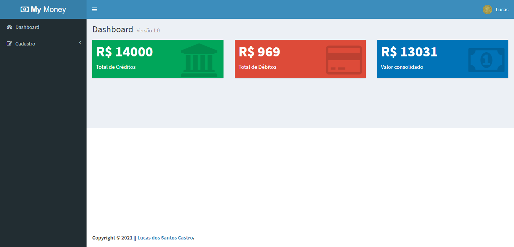
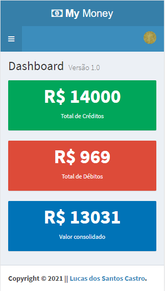

# My Money App

<br />
<p align="center">
  <a href="https://github.com/lucas-castro-developer/cod3r-my-money-app">
    
  </a>

  <h3 align="center">Aplicação financeira - MyMoneyApp</h3>

  <p align="center">
    Organize suas finanças de uma forma inteligente e organizada.
    <br />
    <a href="https://github.com/lucas-castro-developer/cod3r-my-money-app"><strong>Explore as documentações »</strong></a>
    <br />
    <br />
  </p>
</p>

<details open="open">
  <summary>Conteúdos</summary>
  <ol>
    <li>
      <a href="#sobre-o-projeto">Sobre o projeto</a>
      <ul>
        <li><a href="#construído-com">Construído com</a></li>
      </ul>
    </li>
    <li>
      <a href="#iniciando">Iniciando</a>
      <ul>
        <li><a href="#pré-requisitos">Pré-requisitos</a></li>
        <li><a href="#instalação">Instalação</a></li>
      </ul>
    </li>
    <li><a href="#Contribuição">Contribuição</a></li>
    <li><a href="#Licença">Licença</a></li>
    <li><a href="#Contato">Contato</a></li>
  </ol>
</details>

## Sobre o projeto

O projeto My Money App tem por objetivo ajudar os usuários a organizar sua vida financeira.

Para isso, possui recursos como adicionar crédito e débito, organizar os recebimentos e as despesas por mês e ano, e dar a possibilidade do usuário clonar lançamentos de crédito e débito para agilizar o preenchimento das informações.

O sistema possui fluxo de login e o dashboard mostra um total de todas as informações inseridas.

Abaixo, segue imagens do layout construído em dispositivos  `mobile` e `desktop`:

**Mobile**



**Desktop**


### Construído com

Este projeto foi construído com o auxílio das seguintes ferramentas
* [HTML](https://developer.mozilla.org/pt-BR/docs/Web/HTML)
* [CSS](https://developer.mozilla.org/pt-BR/docs/Web/CSS)
* [Javascript](https://developer.mozilla.org/pt-BR/docs/Web/JavaScript)
* [ReactJS](https://pt-br.reactjs.org/)
* [MongoDB](https://www.mongodb.com/2)
* [Bootstrap](https://getbootstrap.com/)
* [React Redux](https://react-redux.js.org/)

<!-- GETTING STARTED -->
## Iniciando

Para começar a manipular o projeto, siga os passos abaixo:

### Pré-requisitos

Certifique-se de ter o MongoDB instalado em sua máquina local.

Para mais informações, [acesse a documentação](https://www.mongodb.com/2)

### Instalação

1. Clone o repositório
 ```sh
 git clone https://github.com/lucas-castro-developer/cod3r-my-money-app.git
 ```

2. Abra uma instância do seu terminal e entre na pasta `backend`
 ```sh
 cd backend
 ```

3. Instale as dependências
 ```sh
 npm install
 ```

4. Certifique-se de que o MongoDB esteja aberto e execute o seguinte o comando:
 ```sh
 npm run dev
 ```

5. Agora abra outra instância do seu terminal e entre na pasta `frontend`:
 ```sh
 cd frontend
 ```

6. Instale as dependências
 ```sh
 npm install
 ```

7. Execute o comando abaixo:
```sh
npm run dev
```

8. Pronto. Seu projeto estará funcionando tanto a nível de backend quanto frontend

## Contribuição

Quer contribuir com este projeto? Então siga os passos abaixo:

1. Realize o fork do projeto
2. Crie sua branch (`git checkout -b feature/AmazingFeature`)
3. Faça o commit das suas modificações/criações (`git commit -m 'Add some AmazingFeature'`)
4. Publique a branch (`git push origin feature/AmazingFeature`)
5. Abra uma Pull Request

## Licença

Este projeto não utiliza nenhum tipo de licença.

## Contato

Lucas dos Santos Castro - [LinkedIn](https://www.linkedin.com/in/lucas-castro-5762a6125/) - lucascastrodeveloper@gmail.com

Project Link: [https://github.com/lucas-castro-developer/cod3r-todo-app-react](https://github.com/lucas-castro-developer/cod3r-my-money-app)
